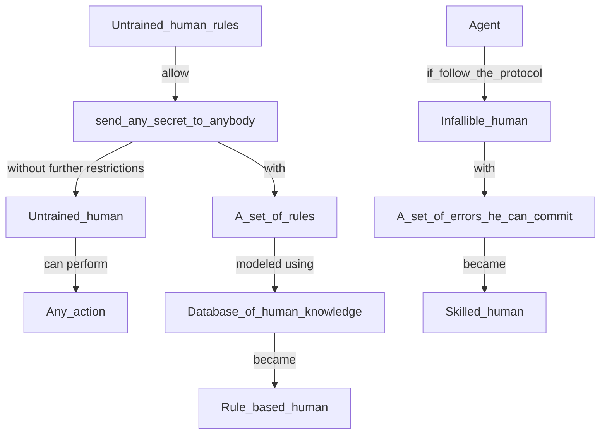
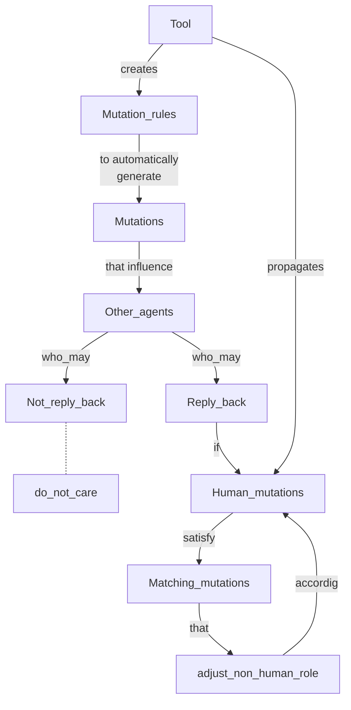

# Human errors within formal verification
More and more protocols involve not only machines but also humans. While protocols used to be executed only between machines, nowadays human interaction is present almost in every system (e.g. website login, trains check-in/check-out).
 Unfortunately, humans are unpredictable and may deliberately deviate from the correct execution of the protocol, undercutting the desired security.

 Formal analysis has been proven effective in finding protocol errors, although it cannot handle possible unexpected human behaviours. 
 Verifying a protocol using formal analysis tools (e.g., Tamarin or ProVerif) involves rigorous protocol representation — consisting of both messages format and messages sequence — and security properties abstraction. 
The verification then proceeds by checking that every sequence of messages does not violate any pre-defined security properties. 

 As already mentioned, it is not easy to consider human behaviours in this analysis as humans are naive, careless, and gullible[1]. 
 Including such unpredictable behaviours might lead to a deeper analysis of the protocol, which would also consider human errors.
 The contribution of this improved analysis would be enormous, as it would allow the devising of protocols that are secure in case of human errors. Also, it would inform about human errors protocols can handle.

## Modeling human errors in security protocols (D. Basin, S. Radomirovic and L. Schmid; 2016)
 Radomirovic et al.[1] formalised in Tamarin a model to include fallible humans in security protocols. They first model an untrained human as an agent who could leak his secrets (by mistake) and then limit his behaviour by adding a set of unbreakable rules (e.g., the leak of a private password is not an acceptable error). 
 Although the approach is interesting, it overlooks errors that involve the incorrect swapping (or even worst substitutions with sensible information) of parts of the messages and their interleaving.

## X-Men: A Mutation-Based Approach for the Formal Analysis of Security Ceremonies (D. Sempreboni and L. Viganò; 2020)
 Later, Viganò et al.[2] , proposed an approach to mutate correct human behaviours. However, these mutations may be rejected by the other agents since they might not comply with the other agent's specifications.
They addressed the problem by also modifying the behaviours of the non-human agents.
 Unfortunately, these adaptations cause substantial alterations to the protocol.

## Modelling Human Threats in Security Ceremonies (G. Bella, R. Giustolisi and C. Schürmann; 2022)

Eventually, Bella et al.[3] devised a modular approach to include within the protocol verification four different human threat models, founding that some security properties collapse against the strongest model.
The models are:
- **Chatty**: a human who discloses his information (long-term password, random numbers ...)
- **Cocky**: a human who gives out its object (ticket, OTP token..)
- **Receipt forger**: a human who counterfeits printouts out of known information
- **Object forger** human who counterfeits objects out of known information

# References

[1] Basin David, Sasa Radomirovic, and Lara Schmid. "Modeling human errors in security protocols." 2016 IEEE 29th Computer Security Foundations Symposium (CSF). IEEE, 2016.

[2] Sempreboni Diego, and Luca Vigano. "X-Men: A mutation-based approach for the formal analysis of security ceremonies." 2020 IEEE European Symposium on Security and Privacy (EuroS&P). IEEE, 2020.

[3] Bella Giampaolo, Rosario Giustolisi, and Carsten Schürmann. "Modelling human threats in security ceremonies." Journal of Computer Security Preprint (2022): 1-23