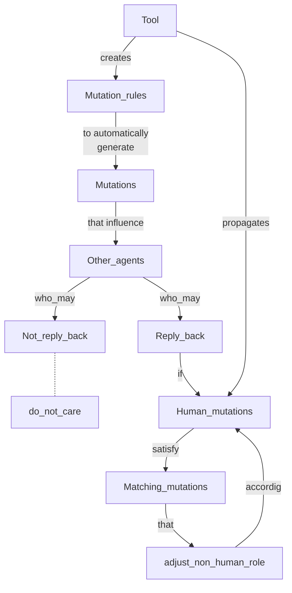
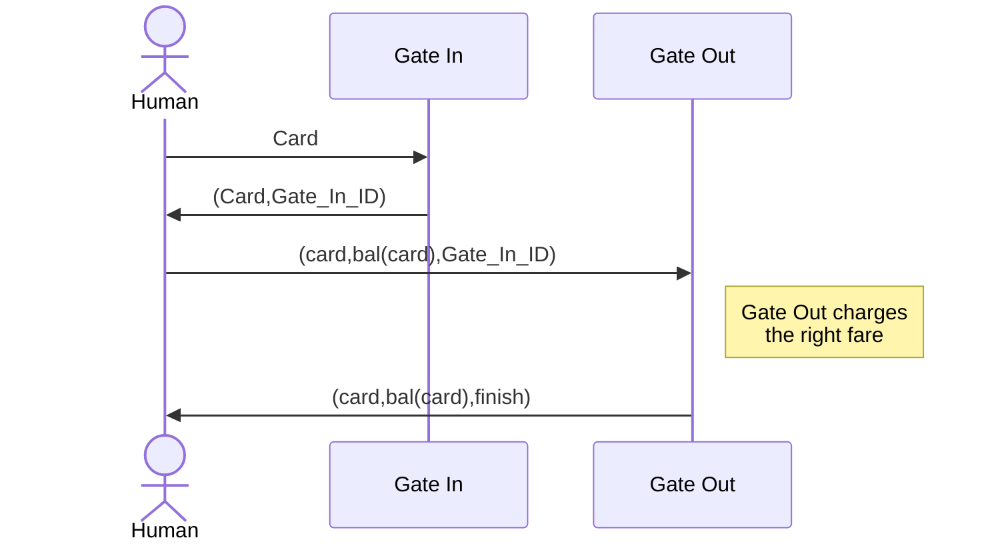

# X-Men: A Mutation-Based Approach for the Formal Analysis of Security Ceremonies

## D. Sempreboni, L. Viganò
### 1. Introduction

### 2. Case study: Main cerimony for the Tube

### 3. The approach