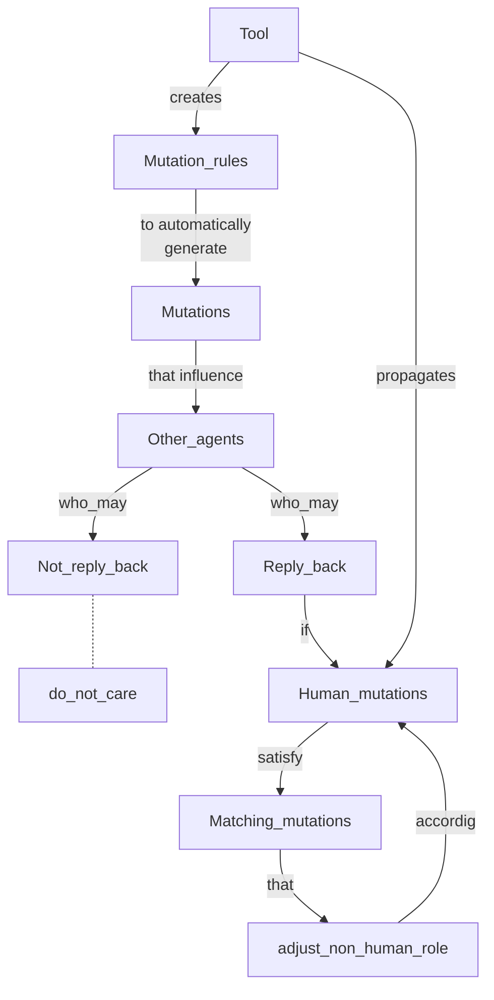
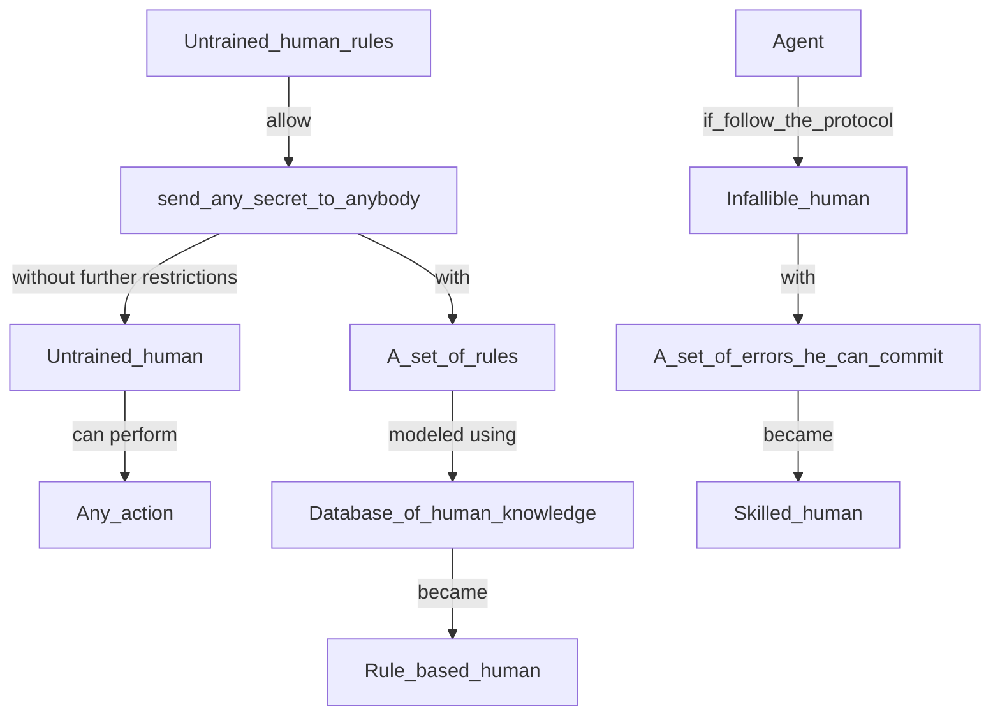

# Human errors within formal verification
## X-Men: A Mutation-Based Approach for the Formal Analysis of Security Ceremonies
### D. Sempreboni and L. Viganò; 2020

## Modeling human errors in security protocols
### D. Basin, S. Radomirovic and L. Schmid; 2016

